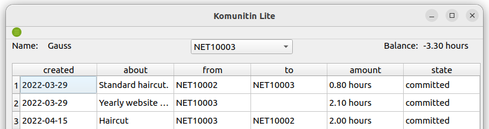

# Komunitin Lite Qt

Basic C++ Qt6 client for komunitin users.

### Build notes:

- Qt6.2 LTS (with Network, Widgets and StateMachine modules).

- OpenSsl 1.1 is needed to run the app, Qt6 is compiled with this version.
  (If your system uses libssl version 3, it won't run)
  
- Build for linux desktop is well tested.
  You can try to build for other platform/s from QtCreator.
  
  
### TODO 

- Make transactions

- CI to build on several platforms.

- Tests, tests, tests...

